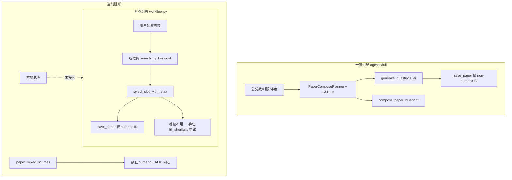
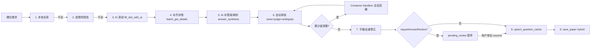
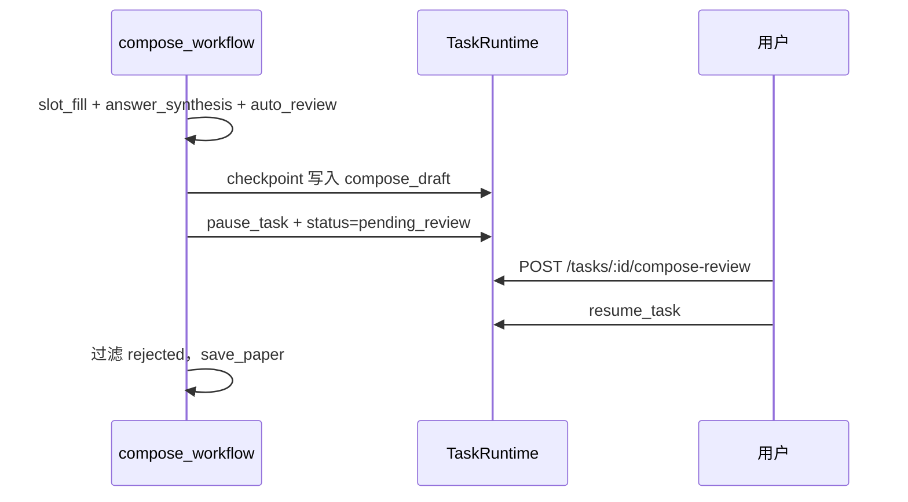
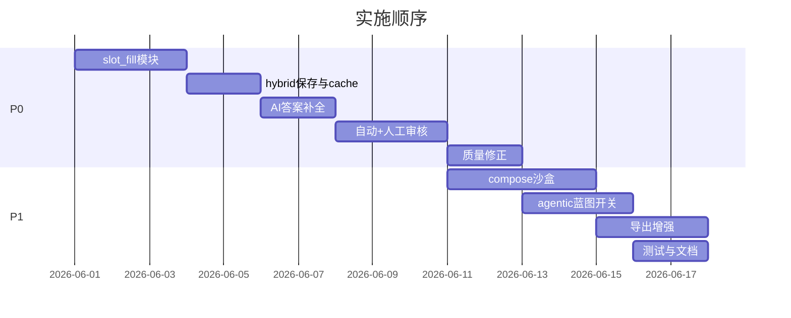

# AI 组卷功能提升计划

> 状态：P0 主链路、P1 compose-sandbox 与人工审核前端入口已落地  
> 更新：2026-06-08  
> 目标：统一题库组卷与 AI 原创、AI 答案补全与审核、Docker 组卷工作台沙盒、混合卷导出

## 实施清单

- [x] 新建 `slot_fill.py`：本地总库 → 爬虫 → AI 三级候选获取
- [x] 扩展 `source_strategy` / 解除 `paper_mixed_sources`，强制 cache 快照
- [x] 改造 `compose_paper_events`：接入 slot_fill、ai_backfill、默认质量参数
- [x] 新增 `answer_synthesis`：缺答案/解析时 AI 补全
- [x] 建立自动审核流水线：AI 原创/补答案题进入自动审校
- [x] 可选人工审（`pending_review` + `compose-review`）后端恢复点与任务中心前端审题 UI 已接入
- [x] `paper_balance` 后可修正 pass 已实现（难度偏差 / 题干重复 / 知识点重复同槽候选替换，默认开启）
- [x] 新建 compose-sandbox Docker 会话 + SessionManager + Agent 工具
- [x] `PAPER_COMPOSE_AGENTIC_BLUEPRINT` 开关已实现（默认关闭，支持 env 与单次请求覆盖）
- [x] 混合卷分卷导出（exam paper / answer key）已接入同步导出与导出任务
- [x] P0 测试覆盖：`test_paper_compose_slot_fill.py`、`test_paper_mixed_sources.py`（含 balance 修正保存前替换、pending_review 草稿与 compose-review API）

---

## 现状诊断

项目已有两条独立路径，能力不对齐：



**核心矛盾**：

| 问题 | 位置 | 影响 |
|------|------|------|
| 蓝图组卷只走爬虫，槽位不足无 AI 补齐 | `backend/generation/paper_compose/workflow.py` | 组卷成功率低，与一键出卷能力割裂 |
| 本地总库未参与选题 | 同上；agent spec 声明 `local_question_library` 但未在 workflow 使用 | AI 出题确认后的题目无法被蓝图复用 |
| 禁止混合题源 | `backend/api/papers.py` + `backend/database/repositories/question/papers.py` | 无法「能选就选、不够再 AI 补」 |
| 蓝图组卷不走 agentic | `backend/tasks/runners.py` 固定调 workflow | task spec 与运行时脱节 |
| 平衡检查仅可观测 | `paper_balance` step 只报告 shortfall | 质量不可控 |
| 导出依赖题干缓存 | `PAPER_STORE_*` 默认关闭 | 混合卷 PDF 可能空白 |
| 缺答案题无法导出答案卷 | `fetch_question_details` 失败或本地库仅 stem | 答案卷/解析卷不可用 |
| AI 原创题审核未接入组卷 | `fill_slot_with_ai` 未强制 judge；组卷无 `pending_review` | AI 补题质量不可控 |
| LaTeX 沙盒只读一次性 | `latex_sandbox.py` `--read-only` | `repair_latex` 只能盲改，难处理缺图/宏包 |
| 测试覆盖薄 | 无 `compose_paper_events` 集成测试 | 改动风险高 |

本轮**不优先做 UI**（蓝图库、任务中心等），以后端编排与 API 能力为主。

---

## 目标架构

引入统一的 **槽位填充编排层**（`backend/generation/paper_compose/slot_fill.py`），被蓝图 workflow、agentic planner、MCP 共用：



**`source_strategy` 请求字段**（向后兼容）：

- `bank_first`（默认）：本地总库 → 爬虫 → AI 补齐
- `bank_only`：仅本地 + 爬虫
- `ai_first`：优先 AI，爬虫 fallback
- `ai_only`：纯原创

---

## Phase 1 — 统一多源槽位填充（P0）

### 1.1 本地总库检索接入

- 在 `slot_fill.py` 封装 `fetch_local_candidates()`，调用 `list_question_library_items`
- 输出对齐 workflow candidate dict，复用 `select_slot_with_relax`

### 1.2 AI 自动补齐 shortfall

- bank 阶段未填满时调用 `fill_slot_with_ai`
- 新增 SSE step：`ai_backfill`
- 默认自动 backfill（`options.autoAiBackfill: false` 可关闭）

### 1.3 解除混合题源限制

- 扩展 `_infer_paper_source_mode`：支持 `hybrid`
- 允许 hybrid 保存，但强制 `upsert_question_cache`（含 stem/answer/analysis/diagrams）
- result 附带 `sourceMode: hybrid|zujuan|local`

### 1.4 API 契约

扩展 `ComposeRequest.options`（`frontend/src/api/blueprint.ts`）：

```typescript
options?: {
  sourceStrategy?: 'bank_first' | 'bank_only' | 'ai_first' | 'ai_only'
  autoAiBackfill?: boolean       // default true
  minQualityScore?: number      // default 60
  dedupByStem?: boolean         // default true
  llmReview?: boolean           // 槽位匹配审阅
  aiAnswerSynthesis?: boolean   // default true：缺 answer/analysis 时 AI 补全
  autoReview?: boolean          // default true：自动审核流水线
  judgePassScore?: number       // default 65
  requireHumanReview?: boolean  // default false
  maxAiQuestionsPerPaper?: number // default 20
  useComposeSandbox?: boolean   // default true（Docker 可用时）
  sandboxMaxIterations?: number // default 8
  includeExport?: 'pdf' | 'tex' | 'none'
}
```

---

## Phase 2 — AI 答案生成与审核（P0）

### 2.1 AI 答案/解析补全（`answer_synthesis`）

**触发**：`fetch_question_details` 之后，有 `stem` 但缺 `answer` 或 `analysis`

**实现**（`backend/generation/paper_compose/answer_synthesis.py`）：

- 复用 `regenerate_question_section` 或 `generate_answer_for_stem`
- 标记 `answer_source: crawler | ai_synthesis | ai_generate`
- SSE step：`answer_synthesis`

**与 AI 补题分工**：

- `fill_slot_with_ai` 强制启用完整 judge 流水线（原创题自带答案）
- `answer_synthesis` 服务题库/爬虫来源的缺答案题

### 2.2 自动审核流水线

复用 `backend/generation/question_library/judging.py`：

| 题目来源 | 审核范围 |
|----------|----------|
| AI backfill / ai_only | `solve_draft` → `check_ambiguity` → `judge_draft` |
| AI 补答案 | `solve_draft` 校验合成答案 |
| 爬虫/本地库 | 可选 `llmReview` + 抽样 `solve_draft` |

- SSE step：`auto_review`
- `action`：`pass` | `replace` | `regenerate_answer` | `reject`
- 低分：先 `regenerate_answer`，仍失败则 `replace`

### 2.3 人工审核（可选）

`requireHumanReview=true` 时：



- 新增 `POST /api/tasks/{taskId}/compose-review`
- Checkpoint：`compose_draft: { questions[], review_summary, slot_mapping }`
- 前端 follow-up：`BlueprintPreviewPanel` 审题 UI

---

## Phase 3 — 组卷质量闭环（P0）

### 3.1 从「可观测」到「可修正」

`paper_balance` 之后轻量修正：

- 难度偏差 → 候选池替换
- 知识点重复 → 同槽换题
- Stem 重复 → 替换或 AI 重写

### 3.2 审阅分工

| 能力 | 职责 |
|------|------|
| `llmReview` | 槽位知识点/难度/题型匹配 |
| `autoReview` | 答案正确性、歧义、完整性 |
| `requireHumanReview` | 教师最终确认 |

### 3.3 默认质量参数

- 默认：`minQualityScore=60`、`dedupByStem=true`、`aiAnswerSynthesis=true`、`autoReview=true`
- `judgePassScore=65`；`requireHumanReview=false`（env `PAPER_COMPOSE_REQUIRE_HUMAN_REVIEW=1` 可全局开启）

---

## Phase 4 — 组卷工作台沙盒（P1）

**形态**：按组卷任务启停的 Docker 会话容器（非长期 VM），覆盖题目 / LaTeX / 配图 / Python 验算。

### 4.1 与现有沙盒差异

| 能力 | `latex-sandbox` | `compose-sandbox` |
|------|-----------------|-------------------|
| 文件系统 | 只读 + 一次性 compile | 可写 `/workspace`，多轮迭代 |
| 生命周期 | 单次 `docker run --rm` | 绑定 taskId |
| 用途 | 仅 xelatex | LaTeX + 题目 JSON + 配图 + 验算 |

### 4.2 镜像与目录

`docker/compose-sandbox/Dockerfile`（基于 latex-sandbox）：

- TeX Live + CJK
- Python 3 + NumPy + SymPy
- 可选 rsvg-convert / ImageMagick

```
/workspace/
  paper.json
  export/paper.tex
  export/assets/
  scripts/verify.py
  build/
```

### 4.3 会话管理器

`backend/generation/paper_compose/compose_sandbox.py`：

- `open` / `exec_command` / `write_file` / `read_file` / `apply_question_patch` / `export_artifacts` / `close`
- 命令白名单：`xelatex`、`python3`、`ls`、`cat`
- Env：`COMPOSE_SANDBOX_*`（见 `docs/CONFIGURATION.md` 待补充）

### 4.4 Agent 工具

| 工具 | 作用 |
|------|------|
| `compose_sandbox_open` | 初始化 workspace |
| `compose_sandbox_read_file` | 读 tex / log / paper.json |
| `compose_sandbox_write_file` | 写 tex / verify.py |
| `compose_sandbox_run` | 白名单命令 |
| `compose_sandbox_patch_question` | 改单题 |
| `compose_sandbox_export` | 导出 pdf + paper |
| `compose_sandbox_close` | 销毁 session |

### 4.5 接入点

- 审核存疑 / 验算题 → 沙盒 Python 验算
- LaTeX 编译失败 → 读 log → 改 tex → 重编译
- SSE step：`sandbox_adjust`

### 4.6 安全

- 无网络、非 root、资源/TTL 限制
- 单任务 workspace ≤ 50MB
- Docker 不可用 → 降级 `repair_latex` + `python_scientific_compute`

---

## Phase 5 — Agentic 编排统一（P1）

- `PAPER_COMPOSE_AGENTIC_BLUEPRINT`（默认 false）
- Planner：slot 迭代 → 审核 → sandbox 调整 → create_paper → 沙盒编译
- workflow 与 agentic 共用 `slot_fill.py`

---

## Phase 6 — 导出与交付（P1）

- hybrid/local 卷自动 cache 存储
- PDF 优先沙盒迭代编译，失败 fallback `repair_latex`
- 分卷：`examPaperUrl`（无答案）、`answerKeyUrl`（答案+解析）已接入同步导出与导出任务

---

## Phase 7 — 测试与文档（P1）

| 测试文件 | 覆盖点 |
|----------|--------|
| `test_slot_fill.py` | 多源填充 |
| `test_answer_synthesis.py` | 答案补全 |
| `test_compose_auto_review.py` | 自动审核 |
| `test_compose_human_review.py` | 人工审核 API |
| `test_compose_sandbox.py` | 沙盒会话 |
| `test_paper_mixed_sources.py` | hybrid 保存 |
| `test_paper_export_bundle.py` | exam paper / answer key 分卷导出 |

更新：`docs/USER_GUIDE.md`、`docs/SEARCH_FILTERS_AND_BLUEPRINTS.md`、`docs/CONFIGURATION.md`

---

## 实施顺序



**PR 拆分建议**：

1. **PR1**：Phase 1 + Phase 2.1 + 2.2（混合组卷 + 答案补全 + 机器审校）
2. **PR2**：Phase 2.3 人工审核 API + 审题 UI
3. **PR3**：Phase 4 compose-sandbox

**本轮不做**：长期复用 VM、任意 shell、蓝图库 UI、AI 出题「加入试卷」按钮

---

## 风险与缓解

- **LLM 成本**：`maxAiQuestionsPerPaper` 默认 20
- **合成答案准确性**：自动审 + 可选人工审；导出可标注 `answer_source=ai_synthesis`
- **混合卷合规**：组卷网题仅提供链接
- **Agentic 不稳定**：蓝图 agentic 默认关闭
- **沙盒安全**：无网络 + 命令白名单 + TTL
