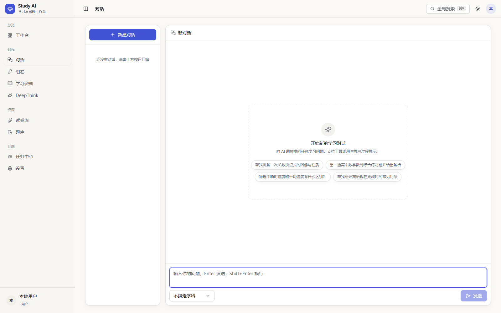
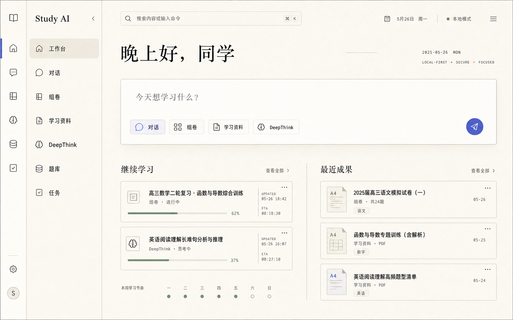
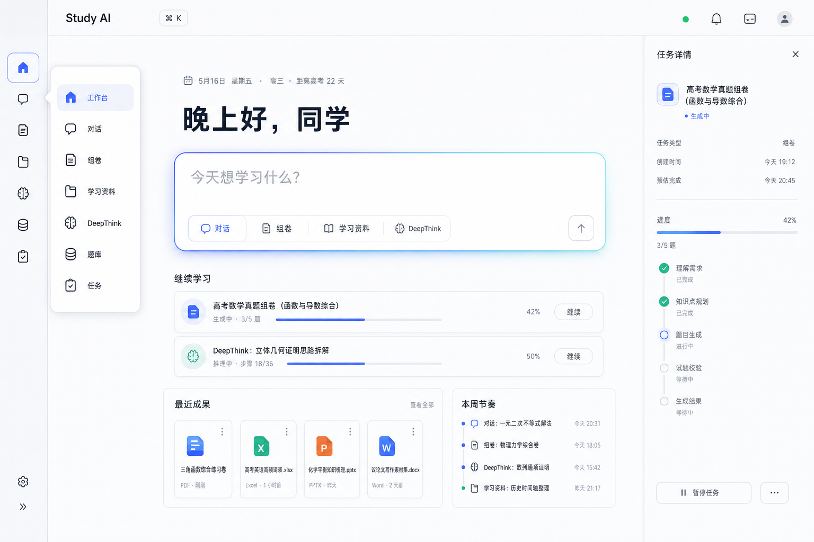

# 前端视觉系统与工具对话体验规划

> 状态：视觉方向已确认，实施方案 Proposed
>
> 日期：2026-07-25
>
> 适用范围：当前 clean-room `frontend/` 与现行 FastAPI / Chat SSE 契约
>
> 关联文档：[前端架构与基础框架设计提案](./2026-07-25-frontend-architecture-foundation-design.md)
>
> 性质：视觉与交互设计记录，不代表页面、协议扩展或组件已经实现

## 1. 已确认决策

本规划记录已经由用户确认的视觉方向：

1. 全局采用 **B+A 混合方向**：
   - B「冷雾光谱」提供 AI 工作空间结构、清晰状态和附着式上下文层。
   - A「暖纸编辑部」提供暖象牙底色、编辑部式排版、纸张质感和学习产品辨识度。
2. 整体比当前界面更圆润，但遵循“主行动越圆，信息越密集越克制”的梯度，不制造气泡墙。
3. 首页从统计看板转为意图优先工作台，以“今天想学习什么？”和“继续学习”为第一层级。
4. 工具调用对话采用 **方案 2「轮次时间线」** 作为默认形态。
5. 当前助手轮次必须显示用户可见的 **思考文本**：
   - 当前轮默认展开并流式更新。
   - 默认展示 3–5 行，可继续展开。
   - 历史轮默认折叠。
6. 单个快速工具自动收缩为行内执行组。
7. 复杂参数、结果、来源、图表和错误详情通过右侧工具检查器展开；移动端降级为底部抽屉。
8. 保持当前 URL、导航能力、核心操作流和 FastAPI 同源部署方式。

## 2. 规划边界

### 2.1 设计来源

本规划只依据：

- 当前磁盘上的 clean-room `frontend/`。
- 当前 `backend/api/**`、`backend/workspace/chat/**` 和任务运行时契约。
- 当前运行页面的浏览器截图。
- 用户在本轮确认的视觉稿和交互选择。
- 官方设计与产品文档。

严格遵守 clean-room 边界：

- 不读取、恢复或参考已删除前端的 Git 历史、blob、diff、缓存、构建产物或截图。
- 不追求与已删除前端的布局、导航、组件或交互相似。
- 当前 clean-room 已存在的用户操作流是需要保护的基线。

### 2.2 与架构规划的关系

[前端架构与基础框架设计提案](./2026-07-25-frontend-architecture-foundation-design.md) 将视觉变化列为其自身的非目标。本规划是用户确认后的独立后续设计，不否定原架构范围，并继续服从以下约束：

- `app -> routes -> features -> entities -> shared` 依赖方向。
- Route Catalog 是路由、导航、标题和命令入口的唯一真源。
- UI 不直接解释原始 SSE。
- 工具时间线消费领域 decoder / reducer 生成的只读投影。
- REST 状态仍归 TanStack Query。
- 活动任务与连接状态仍归 Task/Stream Coordinator。
- 折叠、检查器开关等临时呈现状态才归局部 React 状态或轻量 UI store。

### 2.3 非目标

- 不迁移到 Next.js、SSR、BFF 或第二个服务端运行时。
- 不在视觉规划中重新定义后端任务状态或 Chat SSE 语义。
- 不为了效果图新增当前协议不支持的附件上传。
- 不在 Chat POST 流中伪造暂停、续播、跳过工具或修改正在运行工具的能力。
- 不把“确认并创建”设计成不存在的系统审批事件。
- 不展示或持久化后端未明确标记为用户可见的隐藏推理字段。
- 不要求逐像素复刻概念效果图。

## 3. 当前视觉与交互基线



当前对话页已经具备：

- `/chat` 与 `/chat/:id`。
- 会话创建、切换、重命名和删除。
- 学科选择。
- Enter 发送、Shift+Enter 换行和生成中停止。
- Markdown、GFM 表格、数学公式、代码、链接和图片渲染。
- `thinking_delta`、`iteration`、`tool_start`、`tool_result`、`assistant_final` 和 `error` 的实时接收。

当前主要体验问题：

1. 全局侧栏和对话会话栏同时常驻，形成双重导航并显著压缩回答宽度。
2. 页面外壳、会话栏、消息、思考和每个工具调用都使用独立卡片，层级碎片化。
3. 输入区更像普通表单，不像发起学习意图的主行动中心。
4. 助手正文没有稳定阅读列，宽屏行长过长。
5. 当前思考过程虽然可以展开，但与工具步骤、正文之间缺少清晰的信息架构。
6. 当前前端只保存工具 `id / name / running|success|error`；SSE 已经提供的 `arguments` 和 `result` 被丢弃。
7. 工具结果历史以折叠原文为主，缺少针对搜索、计算、绘图和题目列表的结构化呈现。

## 4. 最终视觉方向：Warm Spectral Workspace

### 4.1 视觉来源

#### A：暖纸编辑部，提供材质与排版



采用：

- 暖象牙画布。
- 深墨文字。
- 编辑部式标题与留白。
- 轻纸张纹理和发丝分隔线。
- 稳定阅读列与清晰基线节奏。

不直接采用：

- 过多衬线正文。
- 过于稀疏、无法承载复杂任务的版式。
- 为了“纸张感”而牺牲控件可辨识度。

#### B：冷雾光谱，提供空间与 AI 状态



采用：

- 意图优先的主输入区。
- 冷雾次级表面。
- 附着式右侧上下文区。
- 靛蓝到微青色的焦点边缘。
- 继续任务、实时进度和结果的闭环。

不直接采用：

- 大面积光谱渐变。
- 泛化 AI SaaS 的玻璃卡片堆。
- 依靠发光而不是排版表达层级。

### 4.2 设计原则

1. **意图优先**：页面第一屏回答“现在要做什么”，不是“系统统计了什么”。
2. **内容优先**：助手正文采用开放式文档排版，只有用户消息使用完整气泡。
3. **渐进披露**：先显示状态摘要，再显示时间线，最后按需展开参数和结果。
4. **圆润有层级**：外层工作空间圆，内部数据结构克制。
5. **状态可解释**：每个运行状态必须有图标、文案和形状差异，不能只靠颜色。
6. **本地优先**：字体、图标和核心材质不依赖公共 CDN。
7. **操作流稳定**：重排空间，不更换用户已经理解的入口和核心行为。

## 5. 全局布局体系

### 5.1 应用骨架

桌面端采用：

```text
┌────────┬──────────────┬────────────────────────────┬──────────────────┐
│ 64 rail│ 208 context  │ primary workspace          │ optional context │
│        │ navigation   │                            │ sheet/inspector  │
└────────┴──────────────┴────────────────────────────┴──────────────────┘
```

- 全局图标轨：`64px`。
- 上下文导航：`208–224px`，可收合。
- 顶部命令区：`64px` 高。
- 主工作区最大宽度：`1480px`。
- 普通内容页左右安全边距：`32–48px`。
- 阅读正文最大行长：`68ch`。
- 右侧检查器：`360–440px`，展开后主回答列不得小于 `640px`。

导航仍由现有路由信息派生，不为了视觉稿增加第二套导航配置。

App Shell 增加三种内容模式，但共用同一导航和 Provider：

| Mode | 适用页面 | 滚动与宽度 |
| --- | --- | --- |
| `document` | 首页、设置、普通列表 | 页面滚动，内容居中并设置最大宽度 |
| `workspace` | 组卷、题库、主从工作区 | 全宽多栏，内部区域明确滚动所有权 |
| `conversation` | 对话 | `h-dvh / min-h-0 / overflow-hidden`，消息区独立滚动，Composer 稳定停靠 |

当前 Shell 使用统一固定 padding 和页面级滚动。迁移时必须先明确：

- 页面、消息区、检查器各自只有一个滚动容器。
- 对话正文建议稳定在 `760–800px`。
- Composer 建议稳定在 `820–880px`。
- Inspector 展开不能制造横向页面滚动。

### 5.2 响应式断点

| 视口 | 布局规则 |
| --- | --- |
| `>= 1440px` | 图标轨 + 上下文栏 + 主工作区；右侧检查器可附着展开 |
| `1100–1439px` | 上下文栏默认收合；检查器以覆盖式 Sheet 展开 |
| `768–1099px` | 保留 64px 图标轨；页面单列；会话历史与上下文均为 Sheet |
| `< 768px` | 底部主导航；时间线单列；工具检查器为高度 70–90dvh 的 Bottom Sheet |

### 5.3 页面模板

#### 首页：Intent Workspace

- 大标题和轻量日期/本地状态。
- 第一主行动是“今天想学习什么？”。
- 输入器内切换：对话、组卷、学习资料、DeepThink。
- 第二层是“继续学习”。
- 第三层是“最近成果”与小型学习节奏。
- 不再把四个 KPI 卡片和空统计图作为第一屏主体。

#### 对话：Conversation Workspace

- 可收合会话栏。
- 中央稳定阅读列。
- 当前轮思考文本。
- 多轮工具时间线。
- 可选右侧工具检查器。
- 底部圆角输入舱。

#### 组卷与学习资料：Split Studio

- 左侧为目标、筛选或配置。
- 右侧为结构化成果、预览或人工审核。
- 生成进度复用工具/任务时间线语言。
- 关键确认固定在成果区附近，不漂浮在页面角落。

#### 题库、试卷库：Library Master–Detail

- 筛选和列表保持高密度、较小圆角。
- 详情通过右侧 Sheet 或稳定主从布局展开。
- 不把每条记录做成大号营销卡片。

#### 任务中心：Task Master–Detail

- 左侧任务列表。
- 右侧任务阶段、事件、人工审核和结果。
- 状态轨道采用与对话时间线相同的视觉语法，但消费持久任务投影。

#### 设置：Quiet Form

- 稳定的设置分组导航。
- 单列表单最大宽度约 `720px`。
- 不使用大面积英雄区和无意义装饰。

## 6. 视觉令牌

### 当前基线与迁移原则

当前视觉基础已经有暖米白背景、靛蓝主色、成功/警告/错误色和两级阴影，可渐进迁移，不需要推倒重来。

当前主要差距：

- 全局 `--radius` 为 `10px`，按钮/输入约 `8px`，卡片/对话框约 `14px`，不足以形成已确认的圆润主行动语言。
- Sheet 桌面端仍是贴边矩形，需要附着式圆角表面。
- Card 默认同时使用边框和阴影，容易形成卡片墙。
- 系统只有 UI sans 与 mono，没有 display / reading 字体角色。
- 常规元信息存在 10–11px 小字，迁移后最低保持 `12px`。
- 缺少思考、工具、时间线、Composer 和 chrome 专用语义 token。
- Tailwind v4 的 sidebar 颜色映射需要统一进入 `--color-*` 命名空间，避免类名与 token 映射不一致。
- 当前 Markdown 的约 `15px / 1.75` 是可保留的良好基础，最终回答只需提升到约 `15.5–16px / 27px` 并限制行长。

禁止只把全局 `--radius` 粗暴放大。应使用角色型圆角和语义 token 渐进迁移。

除基础颜色外，新增：

```css
--thinking-surface;
--thinking-border;
--thinking-foreground;
--tool-idle;
--tool-running;
--tool-success;
--tool-error;
--timeline-rail;
--timeline-marker;
--chrome-surface;
--composer-surface;
```

### 6.1 亮色主题

| Token | 建议值 | 用途 |
| --- | --- | --- |
| `--canvas` | `#F6F1E8` | 应用主画布 |
| `--surface` | `#FFFCF7` | 主内容表面 |
| `--surface-mist` | `#EDF1F7` | 思考、工具、选中和次级上下文 |
| `--surface-raised` | `#FFFFFF` | Sheet、Popover、Dialog |
| `--ink` | `#20242C` | 主文字 |
| `--ink-muted` | `#667085` | 次级文字 |
| `--accent` | `#5664E9` | 主操作、当前阶段、焦点 |
| `--accent-edge` | `#65C7D5` | 仅用于 AI 活动或聚焦边缘 |
| `--success` | `#3D9B70` | 成功 |
| `--warning` | `#C38A2F` | 等待、排队、注意 |
| `--danger` | `#D95757` | 失败、停止、破坏操作 |
| `--border` | `rgba(31, 37, 48, 0.11)` | 发丝分隔线 |

光谱色只出现在：

- 当前输入焦点。
- AI 正在生成。
- 当前时间线阶段。
- 主按钮或选中态。

禁止用大面积紫蓝渐变铺满卡片。

### 6.2 深色主题

深色主题采用“静默石墨”语言：

- `--canvas: #111318`
- `--surface: #181B22`
- `--surface-mist: #20242C`
- `--ink: #F1EEE7`
- `--ink-muted: #9CA3AF`
- 主强调仍使用低饱和靛蓝/青色。

深色主题是同一令牌体系的映射，不维护第二套组件。

### 6.3 字体

不依赖外部 CDN。建议字族：

```css
--font-ui:
  "Inter Variable",
  "Noto Sans SC",
  "PingFang SC",
  "Microsoft YaHei",
  system-ui,
  sans-serif;

--font-display:
  "Noto Serif SC",
  "Songti SC",
  serif;

--font-mono:
  "JetBrains Mono",
  "SFMono-Regular",
  Consolas,
  monospace;
```

- 衬线字体只用于首页问候、少量章节标题和成果封面。
- UI、正文和所有工具状态使用无衬线。
- 时间、百分比、序号、工具参数和日志使用等宽数字或等宽字体。

| 层级 | 字号 / 行高 | 建议字重 |
| --- | --- | --- |
| Display | `40 / 48` | 600 |
| Page title | `30 / 38` | 650 |
| Section title | `22 / 30` | 650 |
| Reading body | `16 / 27` | 400 |
| UI body | `14 / 22` | 450–500 |
| Metadata | `12 / 18` | 500 |
| Tool log | `12 / 19` | 400 mono |

### 6.4 圆角

| Token | 值 | 用途 |
| --- | ---: | --- |
| `--radius-sm` | `8px` | 代码、表格、日志、密集参数 |
| `--radius-md` | `12px` | 普通输入、工具行、列表选择 |
| `--radius-lg` | `16px` | 思考文本、普通面板 |
| `--radius-xl` | `20px` | 工具时间线、用户消息 |
| `--radius-2xl` | `24px` | Composer、Sheet、主要工作区 |
| `--radius-shell` | `28px` | 独立大工作台外壳 |
| `--radius-pill` | `999px` | 模式、筛选、主要快捷回复 |

规则：

- 用户消息可以使用 `20px`，但保留方向性较小角。
- 助手正文不使用完整气泡。
- 思考文本使用 `16–18px`。
- 工具时间线外层使用 `20px`。
- 时间线内部步骤、表格、JSON、错误详情使用 `8–10px`。
- 同一视觉区域嵌套圆角不超过两级。

### 6.5 阴影与材质

- 最多两级阴影。
- 主要层级依赖背景差、分隔线和留白，而不是阴影。
- 纸张纹理透明度不高于 2%，且不得影响文字对比度。
- Sheet/Popover 可使用柔和环境阴影。
- 工具时间线内部不为每一个步骤单独投影。

## 7. 工具对话：方案 2「轮次时间线」

### 7.1 确认效果图


该图片是概念方向，不是逐像素实现规格。

图中的附件图标是构图占位，不代表当前 Chat 协议已经支持附件。近期实现只保留当前真实能力：文本、学科、发送、停止接收，以及可选的模型/深度映射。

### 7.2 一个助手轮次的信息结构

```text
Assistant Turn
├─ Assistant status / interim message
├─ Thinking text
│  ├─ streaming text
│  └─ completed duration / collapse
├─ Iteration timeline
│  ├─ Iteration 1
│  │  ├─ Tool step A
│  │  └─ Tool step B (parallel)
│  ├─ Iteration 2
│  │  └─ Tool step C
│  └─ stopped / failed / max reached
├─ Semantic confirmation prompt (when applicable)
├─ Final answer
└─ Sources / images / paper / artifacts
```

思考、工具执行和最终答案是三个不同层级：

- 思考文本回答“为什么这样做、准备怎么做”。
- 工具时间线回答“实际调用了什么、进行到哪里、发生了什么”。
- 最终答案回答“给用户的结论和成果是什么”。

不得把三者合并为一段连续 Markdown。

### 7.3 渐进披露

#### 简单工具：行内执行组

满足以下条件时自动收缩：

- 只有一个工具。
- 没有并行调用。
- 结果可以用一行摘要表达。
- 运行时间较短。

显示：

```text
[success icon] 科学计算 · 已完成 · 0.8 秒    [查看]
```

#### 默认：轮次时间线

出现以下任一情况时使用完整时间线：

- 两个及以上工具。
- 发生多个 iteration。
- 同一轮有并行工具。
- 工具失败或重试。
- 运行时间较长。
- 最终答案需要等待多路结果。

#### 复杂结果：右侧工具检查器

仅在以下情况提示展开：

- 长题目列表。
- 表格或结构化 JSON。
- 科学计算中间结果。
- 函数图像或其他媒体。
- Web 来源集合。
- 错误详情或原始返回。

检查器不自动抢焦点。用户点击“查看详情”后展开。

### 7.4 思考文本

思考文本是本设计的必选能力。

数据来源：

- 只消费后端明确发送给用户界面的 `thinking_delta`。
- 前端不得自行拼接或臆造隐藏推理。
- 未收到思考文本时显示轻量“正在思考…”状态，不制造模拟内容。

当前轮：

- 第一段内容到达后切换为“思考中”。
- 默认展示 3–5 行。
- 流式追加，但避免每 token 引发布局抖动。
- 用户可展开完整文本或收起。
- 完成后标题变为“思考完成 · 12 秒”；该时间在当前契约下是客户端观察时长，不是模型或服务端权威耗时。

历史轮：

- 当前后端不持久化 `thinking_delta`，消息历史类型也没有 thinking 字段，因此刷新后不能回放。
- Phase 2 先在当前页面会话内保留已完成轮次的思考文本，默认折叠。
- 如果未来后端增加明确的 user-visible thinking 历史字段，才允许跨刷新回放。
- `include_trace` 不能被视为 thinking 持久化契约。
- 不把临时前端缓存伪装成持久记录。

视觉：

- 使用暖雾表面和 `16–18px` 圆角。
- 最大阅读宽度与助手正文一致。
- 使用普通正文排版，不使用代码字体。
- 流式指示只用一个轻量圆点或光标。

### 7.5 Iteration 结构

每个 iteration 包含：

- 序号。
- 用户可理解的阶段名。
- 当前状态。
- 总耗时。
- 一组工具步骤。

同一 iteration 中并行工具采用一条分支线表达，不按完成顺序误画成串行步骤。

当前协议没有 `parallel_group` 或 `execution_mode` 字段。后端会先发出本轮全部 `tool_start`，执行完成后再集中发出 `tool_result`；前端看不到权威的单工具开始、完成顺序和真实耗时。

因此分支线分两级实现：

1. 当前契约下只表达“同一 iteration 的工具集合”，不显示权威的单工具时长。
2. 如果要求准确区分并行与串行，后端需增加 `execution_mode / parallel_group / started_at / finished_at`。

包含 `create_paper` 的整批调用会顺序执行，不能仅把 `create_paper` 自己画成脱离并行的节点。

默认行为：

- 当前 iteration 展开。
- 已完成 iteration 折叠为一行摘要。
- 排队 iteration 只显示标题和“等待中”。
- 时间线只自动滚动到新阶段一次；用户主动向上滚动后暂停跟随，并显示“回到最新”。

### 7.6 Tool Step

每个工具步骤至少包含：

- 用户可理解的名称。
- 本次调用意图或一行输入摘要。
- 状态图标与状态文字。
- 可选的观察时长或后端明确提供的耗时。
- 一行结果摘要。
- “查看详情”入口。

在当前契约下，默认只显示 iteration 总观察时长。效果图中的单工具秒数属于未来服务端时间戳可用后的呈现，不是近期准确性承诺。

Chat 工具步骤使用以下状态子集：

| 状态 | 视觉 |
| --- | --- |
| `queued` | 空心圆 + “等待中” |
| `running` | 旋转弧线 + “执行中” |
| `success` | 对勾 + 结果摘要 |
| `error` | 错误图标 + 简短可读错误 |
| `interrupted` | 断开图标 + “已停止接收，状态未知” |
| `stopped` | 方形停止图标 + “已停止”；只在未来收到服务端取消确认后使用 |

不得只用绿色、橙色或红色表达状态。

`paused / reconnecting / pending_review` 属于持久任务状态，不应在普通 Chat POST 工具步骤中伪造；任务中心可复用同一视觉语言，但消费不同领域投影。

### 7.7 右侧工具检查器

桌面宽度：`360–440px`。

标签页：

- 概览。
- 参数。
- 结果。
- 来源。
- 高级详情。

职责：

- 概览：工具数、成功/失败数、耗时、当前 iteration。
- 参数：结构化参数，隐藏空字段。
- 结果：领域适配后的题目、数值、图表、文件或摘要。
- 来源：Web 链接、题库来源和可验证引用。
- 高级详情：截断后的原始 JSON、日志、request ID。

原始 JSON 和日志默认折叠，不能占据主对话。

移动端：

- 使用 Bottom Sheet。
- 默认高度 70dvh，可拖至 90dvh。
- Escape / 返回键关闭后焦点回到触发按钮。

### 7.8 领域结果适配

| 工具 | 主对话摘要 | 检查器结果 |
| --- | --- | --- |
| 题库筛选 / 搜索 | 找到数量、主要筛选条件 | 题目列表、难度、质量信息、候选选择 |
| 科学计算 | 结论或关键数值 | 输入、表达式、结构化计算结果 |
| 函数绘图 | “已生成图像” + 缩略图 | 完整图像、文件名、缓存和下载信息 |
| Web 搜索 | 来源数量、主题摘要 | 链接列表、摘要和来源状态 |
| 创建试卷 | 创建结果和 paper ID | 试卷入口、摘要和后续操作 |

每种适配器接收解码后的领域结果，不直接读取未知结构。

## 8. Chat SSE 与视图模型映射

### 8.1 当前真实事件

当前 Chat 流不是固定的单一路径。更准确的结构是：

```text
[第 2 轮起] iteration { round, message }
stream_start { iteration, phase?: "tool_decision" }
(text_delta | thinking_delta)*
├─ 有工具
│  └─ assistant -> tool_start* -> tool_result* -> 下一轮
└─ 无工具
   └─ [可能再次 stream_start] -> text_delta* -> assistant_final
[DONE]
```

已确认的契约事实：

- 首轮没有 `iteration` 事件；从第 2 轮起发送，字段名是 `round`。
- 同一 iteration 可能再次出现 `stream_start`。
- 最终回答阶段的 `text_delta` 不保证携带 iteration。
- `tool_start` 含 `tool_call_id`、`tool_name`、`arguments` 和 `iteration`。
- `tool_result` 含 `tool_call_id`、`tool_name`、`result` 和 `iteration`。
- 同一轮可以有多个工具，但 wire event 不明示并行关系。
- 当调用数大于 1、名称有效且整批不含 `create_paper` 时，当前后端才会并行执行。
- 所有 `tool_start` 先发送；所有执行结束后再集中发送 `tool_result`。
- `assistant_final` 含最终内容和总 iteration 数，并可能达到最大轮数。
- 当前 Chat POST 流没有 `after_seq` 续播。
- `[DONE]` 是 transport sentinel，不会进入标准事件 reducer。

### 8.2 目标只读视图模型

```ts
type ChatRunStatus =
  | "idle"
  | "streaming"
  | "done"
  | "interrupted"
  | "error";

interface ThinkingBlockView {
  text: string;
  status: "idle" | "streaming" | "done";
  durationMs?: number;
  userVisible: true;
}

interface ToolStepView {
  id: string;
  iteration: number;
  name: string;
  displayName: string;
  intent?: string;
  status:
    | "queued"
    | "running"
    | "success"
    | "error"
    | "interrupted"
    | "stopped";
  arguments?: unknown;
  result?: unknown;
  summary?: string;
  observedStartAt?: number;
  observedResultAt?: number;
  serverDurationMs?: number;
}

interface ToolIterationView {
  index: number;
  label: string;
  status:
    | "queued"
    | "running"
    | "success"
    | "error"
    | "interrupted"
    | "stopped";
  tools: ToolStepView[];
}

interface ConversationTurnView {
  runStatus: ChatRunStatus;
  interimText: string;
  thinking?: ThinkingBlockView;
  iterations: ToolIterationView[];
  finalText: string;
  maxReached?: boolean;
}
```

UI 只消费该投影，不直接在组件里 switch 原始事件。

### 8.3 事件投影

| Wire event | 投影动作 |
| --- | --- |
| `stream_start` | 创建或更新活动 assistant turn；同轮重复出现时不得重置已投影内容 |
| `thinking_delta` | 追加思考文本并标记 streaming |
| `text_delta` | 追加当前可见正文；不依赖其一定带 iteration |
| `assistant` | 更新工具决策轮的中间可见文本 |
| `iteration` | 使用 `round` 创建/更新第 2 轮以后的阶段说明；首轮由 stream_start 隐式创建 |
| `tool_start` | 按 iteration 增加工具，保存 arguments 和事件到达时间 |
| `tool_result` | 按 call ID 更新状态、结果、摘要和事件到达时间 |
| `assistant_final` | 完成思考和时间线，落入 finalText |
| `error` | 当前活动节点与 turn 进入 error |
| `[DONE]` | 关闭 transport；需要结合是否见过 final/error 判断，不单独等同成功 |

### 8.4 当前前端必须补齐的状态

当前 `LiveMessage.tools` 只保留：

- `id`。
- `name`。
- `status`。

实施时间线前必须增加：

- `iteration`。
- `arguments`。
- `result`。
- 事件到达时间；真实执行时间需要后端字段。
- 可读摘要。
- 同轮工具分组；权威并行关系需要后端字段。

这一扩展属于前端投影层，不要求首先修改后端事件格式。

如果要显示准确的单工具时长和并行分支，则需要后端协议扩展，不能仅由前端推断。

## 9. 确认、停止、失败与断线

### 9.1 语义确认

当前创建试卷等能力通过普通用户消息中的“确认 / 开始 / 可以 / 好的 / ok / yes / go”等语义开放，而不是独立 permission SSE。

完整前置条件：

- 历史消息中已经存在可解析的 `<EXAM_PAPER_PLAN>...</EXAM_PAPER_PLAN>` JSON 方案。
- 当前用户消息命中确认词。
- 满足条件后只是向模型开放完整工具集，模型仍会决定是否调用 `create_paper`。
- `create_paper` 一旦被调用会直接保存，没有第二层系统确认。

当前确认词使用子串匹配，“不可以”“不要开始”等否定表达也可能误命中。正式提供快捷确认按钮前，应为确认语义增加明确的服务端判定或结构化 intent，避免否定句误触发。

因此快捷按钮：

- “确认并创建”。
- “修改方案”。
- “先看候选题”。

本质是向输入框填入并发送普通用户消息。

要求：

- 只在上一轮已经完成并提出方案后显示。
- 不在工具仍运行时显示为系统审批。
- 保持键盘可达和可编辑。

### 9.2 停止

当前真实能力是 Abort 前端 Chat POST 流的接收。

当前限制：

- 没有 Chat cancel endpoint 或 cancel 事件。
- Abort 不保证正在 await 的服务端工具已经停止。
- 当前 `streamPost` 会把 `[DONE]`、普通 EOF 和 `AbortError` 都汇入 `onDone`。
- 当前页面随后会刷新历史并清除 live 数据，因此不会自动保留部分思考、工具结果和回答。

目标行为分两档：

#### 不扩展后端时

- 按钮和结果文案使用“停止接收 / 已停止接收”，不声称“工具已停止”。
- transport 返回明确的 `completed / aborted / eof / error` 终止原因。
- reducer 记录 `stopIntent`、是否见过 `assistant_final`、是否见过 `error` 和是否见过 `[DONE]`。
- 当前页面会话内保留已收到的思考、工具结果和部分回答，并标为 interrupted。

#### 增加取消契约后

- 后端提供可验证的 cancel/ack。
- 收到取消确认后，才把活动工具标记为 `stopped` 并使用“任务已停止”。

概念效果图中的“停止”是目标主操作；近期实现必须按上述真实语义选择文案。

### 9.3 失败

失败必须包含：

- 错误图标。
- “失败”文字。
- 简短人类可读原因。
- 可选“查看详情”。
- 可以通过重新发送消息实现的“重试”入口。

原始错误、request ID 和截断结果进入检查器高级详情。

### 9.4 切换会话与断线

当前行为会在切换会话时 Abort 活动流。

近期规划：

- 切换前显示提示“离开将停止接收当前生成；服务端工具可能仍会执行”。
- 用户确认后中断接收并切换。
- 网络断开显示“连接已中断”，不显示“后台继续”。
- 当前 Chat POST 不支持 `after_seq`，不提供虚假“恢复连接”。

如果未来把 Chat 执行迁移为持久任务，再由 Task Coordinator 提供续播和恢复。

## 10. Composer

默认输入舱：

- `24px` 圆角。
- 文本区与工具栏属于同一个表面。
- 普通状态最小高度约 `112px`，有附件能力前不预留附件展示区。
- 底部左侧：学科、深度/模型映射。
- 底部右侧：发送或停止接收；只有服务端取消契约完成后才使用“停止任务”语义。
- Enter 发送、Shift+Enter 换行保持不变。

空态对话模式：

- 讲清概念。
- 陪我推导。
- 生成练习。
- 整理笔记。

这些是提示策略，不得在后端没有相应契约时伪装成独立模型。

## 11. 组件与目录规划

对话 feature 建议：

```text
features/chat/
├─ api/
│  ├─ client.ts
│  └─ queries.ts
├─ model/
│  ├─ types.ts
│  ├─ reducer.ts
│  ├─ selectors.ts
│  └─ tool-result-adapters.ts
├─ streaming/
│  ├─ contract.ts
│  ├─ decode-event.ts
│  └─ project-event.ts
├─ ui/
│  ├─ conversation-workspace.tsx
│  ├─ conversation-history.tsx
│  ├─ assistant-turn.tsx
│  ├─ thinking-text.tsx
│  ├─ iteration-timeline.tsx
│  ├─ tool-step.tsx
│  ├─ tool-inspector.tsx
│  ├─ semantic-confirmation.tsx
│  └─ prompt-composer.tsx
└─ __tests__/
```

分层：

- 通用 Sheet、Tabs、Button、Progress 和状态图标进入 `shared/ui`。
- Chat 时间线、思考文本和检查器留在 `features/chat/ui`。
- 可跨 Chat / Task Center 复用的纯视觉状态 primitive 可以在稳定后下沉。
- 页面 route 只负责 URL、会话 ID 和 feature 装配。

## 12. 动效与反馈

- 普通 hover/focus：`120–160ms`。
- Sheet/Inspector：`180–240ms`。
- 时间线新节点：轻量 opacity + translate，不缩放整张卡。
- `prefers-reduced-motion` 下禁用位移和持续光晕。
- 进度变化不每 token 触发动画。
- 思考文本按短批次渲染，避免布局持续抖动。
- 聚合状态使用 `aria-live="polite"`，不逐 token 朗读。

## 13. 可访问性

- 所有状态同时提供图标和文字。
- 对比度达到 WCAG AA。
- 思考折叠、iteration 折叠和工具详情使用原生 button 语义。
- Inspector 打开后管理焦点；关闭时焦点返回触发按钮。
- Escape 关闭 Sheet / Inspector。
- 时间线连接线不承担唯一语义。
- 数学公式、图像和工具产物保留可读替代文本。
- 错误、停止和确认按钮不能只在 hover 时出现。

## 14. 实施阶段

### Phase 0：基线与事件 fixture

- 固定当前路由和操作流。
- 为当前 Chat SSE 保存来自现行后端的 fixture。
- 覆盖 thinking、串行工具、并行工具、失败、停止和最大轮数。
- 保存当前页面截图作为视觉基线。

完成条件：

- 不需要浏览器即可重放真实事件。
- 当前行为具有 characterization tests。

### Phase 1：视觉令牌与无状态 primitive

- 新增 Warm Spectral token。
- 收敛排版、圆角、阴影和状态色。
- 实现 ThinkingText、ToolStep、IterationTimeline 的无状态版本。
- 先用 fixture 和 Story/测试页面验证。

完成条件：

- 组件不导入 API 或 store。
- 亮色、深色和 reduced motion 可验证。

### Phase 2：Chat 事件投影

- 把事件 switch 从页面移动到 decoder / reducer。
- 保留 tool arguments / result / iteration。
- 建立 ConversationTurnView。
- 改造 `streamPost`，区分 completed、aborted、ordinary EOF 和 error。
- 实现 stopIntent、失败和 incomplete stream 状态。

完成条件：

- 页面不直接解释 raw SSE。
- 同一 iteration 的工具保持同轮分组；缺少 execution mode 时不宣称并行或显示单工具权威耗时。
- 思考文本与最终答案分别投影。

### Phase 3：接入轮次时间线

- 替换当前 ThinkingBlock 和 ToolCallRow 堆叠。
- 当前轮默认展开。
- 历史轮默认折叠。
- 单工具自动收缩。
- semantic confirmation 按普通消息发送。

完成条件：

- 当前操作流保持不变。
- 工具运行、成功、失败和停止接收都有稳定呈现，且不把接收中断标成服务端已取消。

### Phase 4：右侧工具检查器

- 保存并解码参数与结果。
- 为搜索、计算、绘图、Web 搜索和创建试卷增加结果适配器。
- 桌面 Sheet、平板覆盖层和移动 Bottom Sheet。
- 原始 JSON 进入高级详情。

完成条件：

- 复杂结果不挤压主回答。
- Inspector 可键盘操作并正确恢复焦点。

### Phase 5：App Shell 与页面模板

- 在 Route Catalog 稳定后调整全局图标轨和上下文栏。
- 首页迁移为 Intent Workspace。
- 组卷、资料、题库、任务和设置逐页采用对应模板。
- 每次只迁移一条高频操作链。

完成条件：

- 不维护第二套路由/导航配置。
- URL 与核心用户行为不变。

### Phase 6：视觉回归与性能

- Playwright 覆盖关键宽度和工具状态。
- 长对话、长公式、表格、代码、图像和中文长文本截图。
- 长 iteration 默认折叠；必要时按轮次虚拟化。
- 检查 bundle、re-render 和流式更新频率。

## 15. 测试计划

### Reducer / Contract

- `thinking_delta` 顺序追加。
- `tool_start` 保存 arguments 和 iteration。
- `tool_result` 按 call ID 合并结果。
- 同一 iteration 多工具保持同轮分组；没有服务端字段时不伪造权威并行关系。
- tool failure 不终止其他并行工具的投影。
- `assistant_final` 完成思考和时间线。
- error / Abort / 无 final 的 `[DONE]` 不被误判为成功。
- max reached 显示明确提示。

### Component

- 思考文本默认 3–5 行，可展开与收起。
- 已完成 iteration 默认折叠。
- 运行 iteration 默认展开。
- 单工具使用紧凑态。
- 状态不只靠颜色。
- semantic confirmation 发送普通消息。
- Inspector 标签页和焦点管理。

### E2E

- 创建对话并流式显示思考文本。
- 同轮并行题库搜索与 Web 搜索。
- 科学计算与函数绘图结果进入最终 Markdown。
- 工具失败后查看详情并重试。
- 生成中停止。
- 切换会话时停止提示。
- 宽桌面、窄桌面、平板和移动布局。

### 视觉验收

- 1600×1000。
- 1366×768。
- 1024×768。
- 390×844。
- 亮色和深色。
- reduced motion。
- 中英文混排。
- 长公式、表格、代码、图片和错误态。

## 16. 验收标准

### 全局

- 首页第一视觉层级是学习意图，不是统计卡片。
- 视觉方向符合暖象牙 + 冷雾 + 克制光谱强调。
- 页面最多两级主要浮层和两级嵌套圆角。
- 现有 URL、导航入口和关键操作流不变。

### 对话

- 1600px 宽度下不再同时常驻两个 240px 侧栏。
- 助手正文稳定在约 `68ch` 阅读宽度。
- 用户消息使用气泡，助手正文保持开放。
- 当前轮可以看到实际思考文本，而不只是“正在思考”。
- 多轮和并行工具使用方案 2 的轮次时间线。
- 单工具自动收缩，复杂结果按需打开检查器。
- 思考、工具、最终答案互不混淆。

### 契约

- UI 不直接解释 raw SSE。
- 前端不再丢弃工具 arguments 和 result。
- “确认并创建”发送普通用户消息。
- Chat POST 不显示未支持的暂停、续播、跳过和实时修改工具能力。
- 停止或断线不被误判为后台继续或任务完成。

### 可访问性

- 状态图标、文字和颜色三者同时表达。
- 所有展开、确认、停止和检查器入口可用键盘操作。
- 聚合流式状态可被辅助技术理解，且不逐 token 干扰。
- 所有文本和关键边界达到 AA 对比度。

### 质量门禁

- `npm run lint`。
- `npm run test`。
- `npm run build`。
- 关键 Playwright 截图与交互用例。
- touched-path `git diff --check`。

## 17. 风险与缓解

| 风险 | 缓解 |
| --- | --- |
| 圆角过多形成气泡墙 | 主行动和外层使用大圆角；内部数据降到 8–10px |
| 思考文本与最终答案混淆 | 独立标题、暖雾表面、完成状态和折叠规则 |
| 原始工具结果过长 | 主对话只显示摘要，完整内容进入检查器 |
| 并行工具被误画为串行 | 当前先保留同轮分组；准确分支等待 execution mode / parallel group 字段 |
| 效果图包含当前不支持控件 | 文档明确附件等占位不属于近期承诺 |
| Chat 断线后无法恢复 | 明确显示中断，不伪造后台运行；未来持久化后再接 Coordinator |
| 大量流式更新造成抖动 | 批量刷新思考文本和进度，组件 selector 精细化 |
| 全站视觉重排扩大回归面 | 先 token 和对话试点，再按高频操作链逐页迁移 |
| 架构与视觉重复定义状态 | 视觉层只消费架构层规范化投影 |

## 18. 参考资料

截至 2026-07-25：

- [Vercel Geist Typography](https://vercel.com/geist/typography)
- [Vercel Geist Stack](https://vercel.com/geist/stack)
- [Vercel Geist Sheet](https://vercel.com/geist/sheet)
- [Vercel AI Elements Prompt Input](https://elements.ai-sdk.dev/components/prompt-input)
- [OpenAI Canvas](https://help.openai.com/en/articles/9930697-what-is-the-canvas-feature-in-chatgpt-and-how-do-i-use-it)
- [OpenAI Deep Research](https://help.openai.com/en/articles/10500283-leep-research-faq)
- [Notion Research Mode](https://www.notion.com/help/research-mode)
- [Raycast Themes](https://manual.raycast.com/themes)

这些资料用于提取排版、上下文 Sheet、输入器、进度、中断、来源和主题组织原则；最终方案为针对 Study AI 当前能力和契约重新设计的原创结构。

## 19. 最终决策

采用：

> **Warm Spectral Workspace：以冷雾 AI 工作空间为骨架，以暖纸编辑部排版为气质，以更圆润但有密度梯度的设计令牌统一全站。**

工具对话采用：

> **思考文本 + 方案 2 轮次时间线作为默认；单工具自动收缩；复杂结果按需展开右侧检查器。**

实施优先级：

1. 真实事件 fixture 与视觉 token。
2. Chat 投影 reducer。
3. 思考文本与轮次时间线。
4. 工具检查器。
5. App Shell 与首页。
6. 其他工作区模板。

在 live wiring 完成前，可以先开发无状态视觉组件；但只有在真实事件 fixture、reducer 和操作流回归通过后，才能宣称工具对话方案完成。
